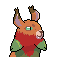

<!--
This README was made using Louis3797's awesome-readme-template
-->

  <h1>Elestrals Mod (Currently just Equilynx)</h1>
  
  
  

    A mod that adds Elestrals themed things to Cobalt Core
  

<!-- About -->
## :star2: About the mod

<!-- Features -->
### :dart: Features

- 1 Character
- 22 Cards (only 2 right now)
- 6 Artifacts (0 so far)
- 4 Statuses (0 so far)

(more coming soon!)